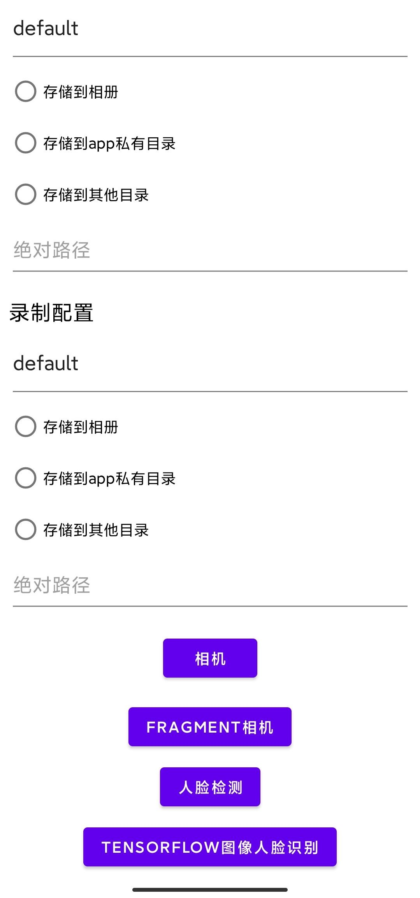
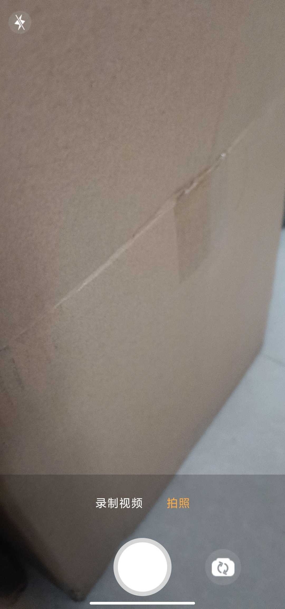

# CameraLlib
集成了拍照，录制视频，人脸识别等的camerax库。

适配了Android10以上的分区存储，可以将图片和视频存储到app私有目录，相册和相册下文件夹，其他SAF能授予文件夹权限的位置。

内置了人脸识别，并预留出来了改变分析器使用其他图像分析的方法。

推荐直接把`camerax_lib`集成到项目

* 版本号 [](https://jitpack.io/#Knightwood/SimpleCameraX)

```
allprojects {
		repositories {
			...
			maven { url 'https://jitpack.io' }
		}
	}
 
 dependencies {
	        implementation 'com.github.Knightwood:SimpleCameraX:Tag'
	}
```

## 截图



## 用法

1. 存储配置

```
首先是配置：
//屏幕方向这个可选，可以固定竖屏、横屏、不设置。
//需要在清单文件的相机activity中添加如下配置，另持有相机的activity在旋转屏幕时不被销毁重建
 android:configChanges="orientation|screenSize"


Application或者Activity中，初始化全局存储位置
StorageConfig.prepare(application)//灰常重要
对于拍摄和录制，可以分别配置存储位置，如果不进行配置，则默认存储到相册文件夹。
例如：
fun initPhoto() {
        page.rg1.setOnCheckedChangeListener { group, checkedId ->
            val relativePath = page.relativePath1.text.toString()
            when (checkedId) {
                R.id.save_app_1 -> {//存储到app私有目录
                    if (Build.VERSION.SDK_INT >= Build.VERSION_CODES.Q) {
                        StorageConfig.configStorageApp(MediaType.photo, relativePath)
                    } else {
                        StorageConfig.configStorage(
                            MediaType.photo,
                            LocationKind.APP,
                            getExternalFilesDir(null)!!.absolutePath,
                            relativePath
                        )
                    }
                }
                R.id.save_dcim_1 -> {//存储到相册
                    if (Build.VERSION.SDK_INT >= Build.VERSION_CODES.Q) {
                        StorageConfig.configStorageDCIM(MediaType.photo, relativePath)
                    } else {
                        StorageConfig.configStorage(
                            MediaType.photo,
                            LocationKind.DCIM,
                            relativePath = relativePath
                        )
                    }
                }
                R.id.save_other_1 -> {//存储到其他位置
                    if (Build.VERSION.SDK_INT >= Build.VERSION_CODES.Q) {
                        StoreX.with(this).safHelper.requestOneFolder {
                            StorageConfig.configStorageOther(MediaType.photo, it)
                            page.path1.setText(it.path, TextView.BufferType.NORMAL)
                        }
                    } else {
                        StorageConfig.configStorage(
                            MediaType.photo,
                            LocationKind.OTHER,
                            path = page.path1.text.toString(),
                            relativePath = relativePath
                        )
                    }
                }
            }
        }
    }
```

2. 直接继承自`BaseCameraXActivity`就可以自定义相机

3. 或者可以自己实现一个activity,内部放置一个`NewCameraXFragment`就可以实现相机功能

   

## 其他介绍

`NewCameraXFragment`实现` CameraCommon`接口，对外提供各种相机方法，实际上各类实现是由`cameraHolder`实现。

* `NewCameraXFragment`内部创建`CameraHolder`

```
class NewCameraXFragment : Fragment(), CameraCommon {

//activity生成fragment时指定此处的图像分析器提供工具
var outAnalyzer: AnalyzerProvider? = null
........

//相机    
cameraHolder = CameraHolder(
            page.cameraPreview,
            page.graphicOverlayFinder,
            cameraConfig,
            page.root
        ).apply {
            bindLifecycle(requireActivity())//非常重要，绝对不能漏了绑定生命周期
            if (!this@NewCameraXFragment::faceProcess.isInitialized) {
                //初始化默认的面部识别工具
                faceProcess =
                    FaceContourDetectionProcessor(
                        page.cameraPreview,
                        page.graphicOverlayFinder,
                    )
            }
            //提供图像分析器
            analyzerProvider = outAnalyzer
        }
        //使用changeAnalyzer方法改变camerax使用的图像识别器
        // cameraHolder.changeAnalyzer(VisionType.Barcode)
        eventListener?.cameraHolderInited(cameraHolder)//通知外界holder初始化完成了，可以对holder做其他操作了
```

* `BaseCameraXActivity`

  持有`NewCameraXFragment`实现相机功能，并提供了额外的功能。

  初始化`NewCameraXFragment`要遵循代码中的三条初始化顺序。

```
  private fun setCameraFragment() {
          cameraXFragment = NewCameraXFragment.newInstance(cameraConfig)
              .apply {
                  eventListener = object : CameraXFragmentEventListener {
                      override fun cameraHolderInited(cameraHolder: CameraHolder) {
                      //1. holder初始化完成
                          setCameraEventListener(object : CameraEventListener {
                              //2. holder初始化完成后，相机也初始化完成了
                              override fun initCameraFinished() {
                                  this@BaseCameraXActivity.initCameraFinished()
                                  //3. 初始化其他内容
                              }
                          })
                          setAnalyzerResultListener(object : AnalyzeResultListener {
                              //图像分析成功时，例如调用拍照
                              override fun isSuccess() {
                                  captureFace()
                              }
                          })
                          //拍照录视频操作结果通知回调
                          setCaptureResultListener(object : CaptureResultListener {
                              override fun onVideoRecorded(filePath: String) {
                                  Log.d("CameraXFragment", "onVideoRecorded：$filePath")
                                  // 视频拍摄后
  
                              }
  
                              override fun onPhotoTaken(filePath: String) {
                                  Log.d("CameraXFragment", "onPhotoTaken： $filePath")
                                  //图片拍摄后
  
                              }
                          })
                      }
  
                  }
              }
          supportFragmentManager.beginTransaction()
              .replace(R.id.fragment_container, cameraXFragment).commit()
      }
```

人脸检测

`FaceContourDetectionProcessor`文件中配置检测模式。

```
.setPerformanceMode(FaceDetectorOptions.PERFORMANCE_MODE_FAST)//在检测人脸时更注重速度还是准确性，精确模式会检测到比快速模式更少的人脸
.setContourMode(FaceDetectorOptions.CONTOUR_MODE_ALL)//轮廓检测
.setLandmarkMode(FaceDetectorOptions.LANDMARK_MODE_ALL)//面部特征点
.setClassificationMode(FaceDetectorOptions.CLASSIFICATION_MODE_NONE)//是否将人脸分为不同类别（例如“微笑”和“眼睛睁开”）。
.setMinFaceSize(0.6f)//人脸最小占图片的百分比
```

  # cameraButtom

此按钮控件用于拍照和录像，支持点击拍照，点击录像和长按录像，长按录制有动画

支持设置录制时长，到达录制时长后回调通知结束录制。

可以设置按钮仅支持拍照，仅支持录制，或都支持

1. 在开启长按录制时，点击录制将不可用

2. 开启点击录制时，拍照不可用

布局文件示例

```
<com.kiylx.camerax_lib.main.buttons.CameraButton
    android:id="@+id/full_capture_btn"
    android:layout_width="wrap_content"
    android:layout_height="wrap_content"
    app:layout_constraintBottom_toBottomOf="parent"
    app:layout_constraintLeft_toLeftOf="parent"
    app:layout_constraintRight_toRightOf="parent"
    app:buttonMode="both" //指定可拍照，可录制
    app:longPassRecord="true" //开启长按录制
    app:layout_constraintTop_toTopOf="parent"
    app:size="80" />
```

使用示例

```
page.fullCaptureBtn.setCaptureListener(object : DefaultCaptureListener(){
	//拍照
    override fun takePictures() {
        cameraXFragment.takePhoto()
    }
    //开始录制视频
    override fun recordStart() {
        page.captureVideoBtn.visibility = View.GONE
        LogUtils.dTag("录制activity", "开始")
        cameraXFragment.takeVideo()
        //录制视频时隐藏摄像头切换
        page.switchBtn.visibility=View.GONE
    }

    //录制视频到达预定的时长，可以结束了
    override fun recordShouldEnd(time: Long) {
        page.captureVideoBtn.visibility = View.VISIBLE
        LogUtils.dTag("录制activity", "停止")
        cameraXFragment.stopTakeVideo(time)
        page.switchBtn.visibility=View.VISIBLE
    }
})
```

# 示例代码在app目录下。

