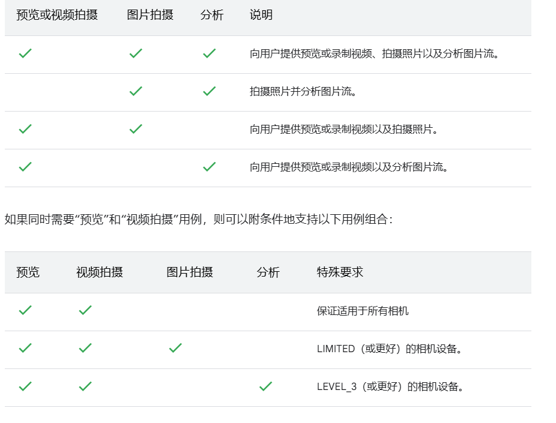

## 自定义界面
首先要知道的是，`CameraHolder`类实现了相机的所有功能，例如用例切换，拍照，录像，图像分析等功能。

而`CameraXFragment`则是最基本的相机界面实现类，它在布局中仅需要一个`PreviewView`实现预览，以及通过持有`CameraHolder`来控制和提供相机各项功能。

而在app module中，我们提供了`CameraExampleActivity`和`CameraExampleActivity2`两个相机实现的例子。  
前者继承自`BaseCameraXActivity`。后者将`BaseCameraXFragment`放入布局的`FragmentContainerView`中。

* `BaseCameraXActivity`类则是将`CameraXFragment`放入布局的`FragmentContainerView`中。并提供了拍照按钮，闪光灯按钮，点击对焦按钮等界面元素。
* `BaseCameraXFragment`类继承自`CameraXFragment`，修改了布局文件，并提供了拍照按钮，闪光灯按钮，点击对焦按钮等界面元素。

### 从BaseCameraXFragment或BaseCameraXActivity自定义界面

!!! note
    `BaseCameraXFragment`或`BaseCameraXActivity`是功能界面的简单实现，提供的自定义功能非常的有限，更多的是告诉你怎么实现一个功能界面。
    如果你需要完全自定义的功能界面，可以参照这两个类，并使用`CameraXFragment`实现完全自定义的功能界面

`BaseCameraXFragment`或`BaseCameraXActivity`一个是fragment，一个是activity，

但他们的自定义过程都是相似的，他们都在内部通过provideView方法提供界面元素。
且使用IControllerPanel接口来实现部分通用界面元素的控制， 例如底部的拍照按钮，拍照和录像按钮切换，显示和隐藏底部界面等。

所以，如果你需要自定义界面，需要通过provideView方法来提供界面元素，并实现一些方法提供交互，例如实现IControllerPanel接口来控制界面元素的交互功能。

#### BaseCameraXFragment provideView方法
```kotlin
 override fun provideView(
        inflater: LayoutInflater,
        container: ViewGroup?,
        savedInstanceState: Bundle?
    ): View {
        
        //自定义的布局文件
        val viewRoot = FragmentCameraxExampleBinding.inflate(inflater, container, false)
        //处理merge标签
        val controllerPanelBinding = BottomControllerPanelBinding.bind(viewRoot.root)
        //底部控制面板交互功能
        controllerPanel = ControllerPanel(requireActivity(), controllerPanelBinding)
        //初始化
        controllerPanel.initAll()
        //事件监听
        controllerPanel.eventListener = object : IControllerPanelEventListener {
            override fun switchCamera() {
                //要保持闪光灯上一次的模式
                if (canSwitchCamera()) {
                    this@BaseCameraXFragment.switchCamera()
                }
            }

            override fun switchCaptureBtnType(type: Int) {
                //这里可以监听到切换按钮的模式
            }
        }
        //拍照，拍视频的UI 操作的各种状态处理
        (controllerPanel as ControllerPanel).setCaptureListener(object : DefaultCaptureListener() {
            override fun takePictures() {
                takePhoto()
            }

            //开始录制视频
            override fun recordStart() {
                LogUtils.dTag("录制activity", "开始")
                startRecord()
                controllerPanel.showHideCameraSwitch(true)
                //录制视频时隐藏摄像头切换
                if (!cameraConfig.recordConfig.asPersistentRecording) {
                    controllerPanel.showHideUseCaseSwitch(true)
                }
            }

            //1. 录制视频到达预定的时长结束
            //2. 或者手动按下按钮录制结束
            override fun recordShouldEnd(time: Long) {
                LogUtils.dTag("录制activity", "停止")
                stopRecord(time)
                controllerPanel.showHideCameraSwitch(false)
                controllerPanel.showHideUseCaseSwitch(false)
            }
        })
        
        super.onCreate(savedInstanceState)
        return viewRoot.root
    }

```

#### BaseCameraXActivity provideView方法
```kotlin
 open fun provideView(
        savedInstanceState: Bundle?
    ): View {
        val page = ActivityCameraExampleBinding.inflate(layoutInflater)
        val controllerPanelBinding = BottomControllerPanelBinding.bind(page.root)//处理merge标签
        //底部控制面板交互功能
        controllerPanel = ControllerPanel(this, controllerPanelBinding)
        controllerPanel.initAll()
        controllerPanel.eventListener = object : IControllerPanelEventListener {
            override fun switchCamera() {
                //要保持闪光灯上一次的模式
                if (cameraXFragment.canSwitchCamera()) {
                    cameraXFragment.switchCamera()
                }
            }

            override fun switchCaptureBtnType(type: Int) {
                //这里可以监听到切换按钮的模式
            }
        }
        //拍照，拍视频的UI 操作的各种状态处理
        (controllerPanel as ControllerPanel).setCaptureListener(
            object : DefaultCaptureListener() {
                override fun takePictures() {
                    cameraXFragment.takePhoto()
                }

                //开始录制视频
                override fun recordStart() {
                    LogUtils.dTag("录制activity", "开始")
                    cameraXFragment.startRecord()
                    controllerPanel.showHideCameraSwitch(true)
                    //录制视频时隐藏摄像头切换
                    if (!cameraConfig.recordConfig.asPersistentRecording) {
                        controllerPanel.showHideUseCaseSwitch(true)
                    }
                }

                //1. 录制视频到达预定的时长结束
                //2. 或者手动按下按钮录制结束
                override fun recordShouldEnd(time: Long) {
                    LogUtils.dTag("录制activity", "停止")
                    cameraXFragment.stopRecord(time)
                    controllerPanel.showHideCameraSwitch(false)
                    controllerPanel.showHideUseCaseSwitch(false)

                }
            })
        return page.root
    }
```

#### IControllerPanel接口

IControllerPanel接口是为了统一处理底部控制面板的UI操作，比如点击录像时，隐藏摄像头切换，用例切换等ui。

```kotlin
interface IControllerPanel {
    //这个是监听面板事件，拍照按钮点击，录像按钮点击，切换相机按钮点击等
    var eventListener: IControllerPanelEventListener?
    //设置切换拍照或录制按钮文字颜色
    fun setBottomButtonTextColor(id: Int)
    //显示或隐藏前后镜头切换
    fun showHideCameraSwitch(hide: Boolean = true)
    //显示或隐藏切换用例按钮
    fun showHideUseCaseSwitch(hide: Boolean = true)
    //显示隐藏拍照按钮，相册等
    fun showHideControllerButton(hide: Boolean = true)
    //初始化所有ui
    fun initAll()
    //显示或隐藏所有ui
    fun showHideAll(hide: Boolean)
}

interface IControllerPanelEventListener {
    //通知前后镜头切换
    fun switchCamera()
    //通知切换拍照或录像按钮
    fun switchCaptureBtnType(type: Int)
}
```

### 从最基础的CameraXFragment自定义界面

这一部分非常的简单。

- 如果用fragment实现，则继承`CameraXFragment`即可。
- 如果用activity实现，则将`CameraXFragment`放入合适的容器中即可。

具体的实现可以参照`BaseCameraXFragment`和`BaseCameraXActivity`

## 自定义用例

* `UseCaseHolder` 类初始化预览，拍照用例，录像用例，图像分析用例
* 提供设置初始化用例方法
* 提供分辨率和纵横比筛选方式

### 指定预览与拍照所需要的分辨率与纵横比筛选
修改UseCaseHolder.resolutionSelector变量，提供预览与拍照所需要的分辨率与纵横比筛选

```kotlin
    //指定筛选条件用于预览和拍照
    UseCaseHolder.resolutionSelector = ResolutionSelector.Builder()
        //分辨率筛选
        .setResolutionFilter { supportedSizes, rotationDegrees ->
            supportedSizes
        }
        //纵横比选择策略 16:9 比例
        .setAspectRatioStrategy(AspectRatioStrategy.RATIO_16_9_FALLBACK_AUTO_STRATEGY)
        //分辨率策略选择最高可用分辨率
        .setResolutionStrategy(ResolutionStrategy.HIGHEST_AVAILABLE_STRATEGY)
        //设置允许的分辨率模式。
        .setAllowedResolutionMode(ResolutionSelector.PREFER_CAPTURE_RATE_OVER_HIGHER_RESOLUTION)
        .build()
```

### 修改默认的用例初始化
如默认的初始化不满足需要，可以调用[setInitImpl]方法，提供自己所需要的初始化
示例：使某个类继承自IUseCaseHelper，并实现初始化预览，拍照用例，录像用例，图像分析用例的方法
  ```
  class IMPL:IUseCaseHelper{
  	........省略
   override fun initVideoCapture(
        cameraExecutor: ExecutorService,
        screenAspectRatio: Int,
        rotation: Int,
        size: Size,
        cameraConfig: ManagerConfig
    ): androidx.camera.video.VideoCapture<Recorder> {
        val videoCapture =
            OnceRecorderHelper.getVideoCapture(cameraExecutor, rotation, cameraConfig.recordConfig)
        return videoCapture
    }
    ........省略
    
  }
  val impl =IMPL()
  //在相机初始化之前调用，提供自己的实现
  UseCaseHolder.setInitImpl(impl)
  
  ```

#### 自定义用例组合
在上一步中，我们提供了自定义的初始化用例的实现。  

在相机配置的[用例模式部分](相机配置.md)，我们讲*配置相机启动时的模式就是在指定用例组合*。  

其中，可以使用`UseCaseMode.customGroup`方法自定义用例组合。
如果是不支持的用例组合，会抛出异常。


```kotlin
return ManagerConfig().apply {
            this.recordConfig = videoRecordConfig
            this.useCaseMode =  //通过调用UseCaseMode.customGroup方法自定义了一个可以预览，录像，图像分析的用例组合
                UseCaseMode.customGroup(
                    UseCaseHexStatus.USE_CASE_PREVIEW,
                    UseCaseHexStatus.USE_CASE_IMAGE_ANALYZE,
                    UseCaseHexStatus.USE_CASE_VIDEO_CAPTURE
                )
            this.flashMode = FlashModel.CAMERA_FLASH_AUTO
            //android R以下时，在少数display为null的情况下，设置预览，拍照的默认分辨率
            this.size = Size(1920, 1080)
        }
```

## 方法调用时序

[new Fragment()]-> [Fragment.onViewCreated]-> [initCameraHolder(生成并初始化CameraHolder)]  
->[CameraXFragmentEventListener.cameraHolderInitStart] -> [CameraXManager.bindLifecycle]  
->[CameraXManager.initManager]->[CameraManagerEventListener.initCameraStart]->initCamera、initUseCase ->绑定UseCase  
->[CameraManagerEventListener.initCameraFinished]->[CameraXFragmentEventListener.cameraHolderInitFinish]  
